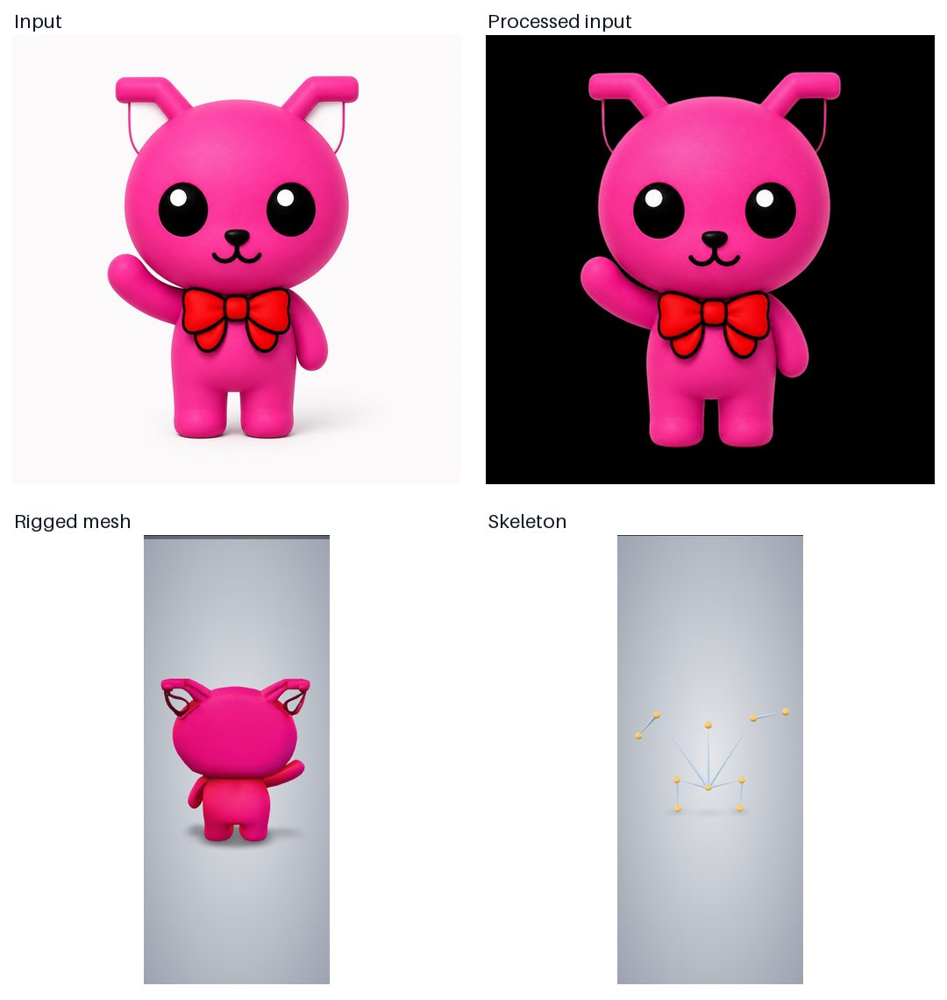
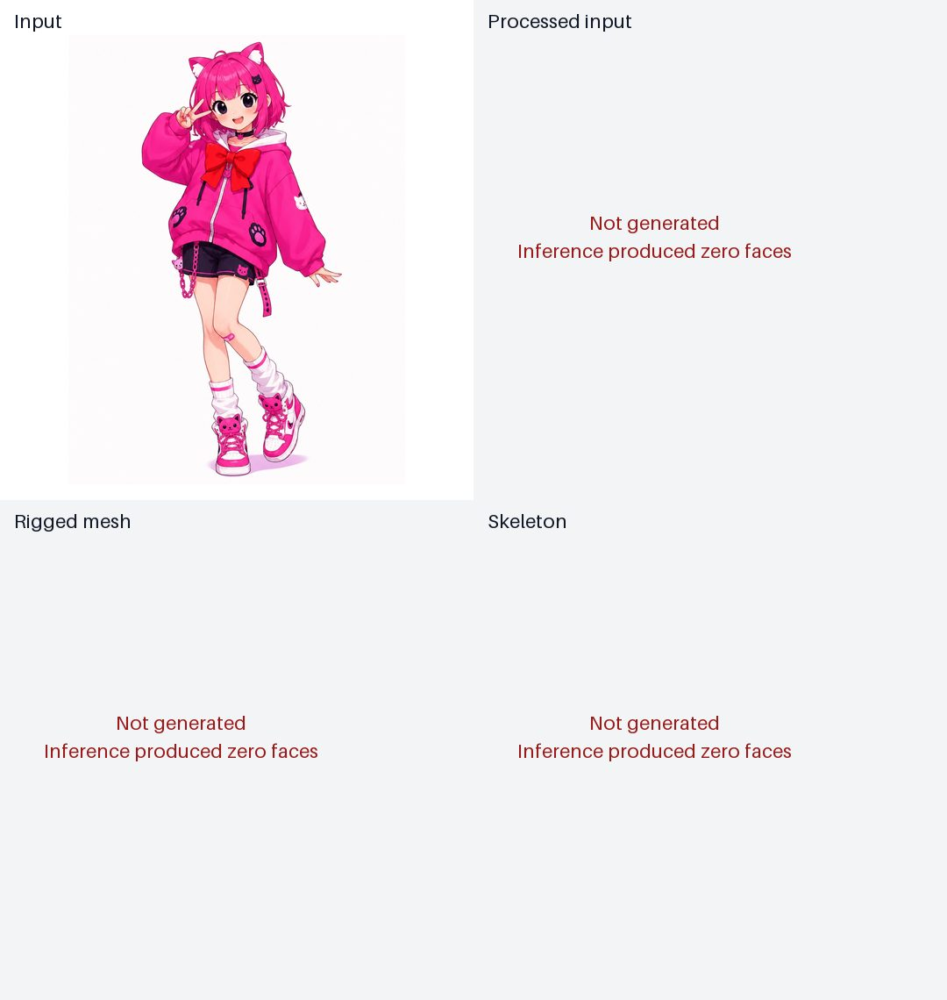

# AniGen on Apple Silicon

[AniGen-mac](https://github.com/pawel-mazurkiewicz/AniGen-mac) を Apple Silicon
Mac で実行し、2枚の猫画像からリグ付き3D assetを生成できるか検証します。

## Purpose

本検証で明らかにしたい問いは次のとおりです。

- macOS / MPS portを固定した環境で、画像から `mesh.glb`、`skeleton.glb`、
  `processed_image.png` を生成できるか
- GLBにmesh geometry、skeleton、skinningに必要なjoint・weight属性が含まれるか
- 正方形と縦長の猫画像で、生成された外観と骨格を視覚的に確認できるか

成功条件は、2入力の公式成果物が生成され、GLB 2.0として読み込め、rigged meshに
skin、joint、`JOINTS_0`、`WEIGHTS_0`が存在することです。品質は入力、背景除去後画像、
mesh、skeletonの静止比較とターンテーブル動画で観察します。

## Input and fixed conditions

- `tests/assets/jpg/miineko1_1254x1254_159kb.jpg`（1254x1254）
- `tests/assets/jpg/miineko2_1086x1448_219kb.jpg`（1086x1448）
- AniGen-mac commit: `4ff0baa4965a0b7e628949b7152167dae12324b8`
- seed: 42
- SS Flow: `ss_flow_duet`（default）
- SLat Flow: `slat_flow_auto`（default）
- simplify ratio: 0.95（default）
- texture size: 1024（default）
- bake mode: `fast`（MPS default）
- deterministic torch behavior: disabled（後述の失敗した試行を参照）

学習済みweightはAniGenの `ensure_ckpts()` が初回実行時にHugging Faceから取得します。

## Requirements and run

- Apple Silicon Mac、macOS 26以降
- Full Xcode 26以降とMetal Toolchain
- mise、uv、Node.js、Google Chrome、ffmpeg
- 初回の依存、Metal extension、学習済みweight取得に約24 GBの空き容量

初回実行時の実測disk使用量は、AniGen sourceとcheckpointが約21 GB、Python環境が
約1.9 GB、背景除去モデルが約929 MB、torch hub cacheが約297 MB、viewer用Node依存が
約80 MBでした。checkpointだけで約20 GBあり、そのうちAniGenのweight群が約18 GB、
DINOv2が約1.1 GB、VGGが約528 MB、DSINEが約408 MBです。

`ensure_ckpts()`は今回使用する`ss_flow_duet`と`slat_flow_auto`以外のvariantも取得します。
例えば未使用の`ss_flow_solo`、`ss_flow_epic`、`slat_flow_control`も合計約8.6 GBを占めます。
本検証ではupstreamの自動取得手順をそのまま評価するため削除していません。

リポジトリルートから一括実行します。

```sh
mise -C 2026/07/11/anigen-mac run
```

個別taskは次のとおりです。

```sh
mise -C 2026/07/11/anigen-mac run generate
mise -C 2026/07/11/anigen-mac run validate
mise -C 2026/07/11/anigen-mac run render-preview
mise -C 2026/07/11/anigen-mac run preview
```

完了済みの成功・失敗結果は再利用します。同条件の推論を明示的に再試行する場合は
`ANIGEN_FORCE=1 mise -C 2026/07/11/anigen-mac run generate`を実行します。

`preview` はローカルHTTP serverを起動し、入力、処理後画像、rigged mesh、skeletonを
切り替えられる3D viewerを開きます。生成されるMP4は外部motionによるanimationではなく、
静止poseのmeshを一周するcamera previewです。

## Observed results

Apple M1 Max、64 GB memoryのMacBook Proで、固定seed 42を各入力1回実行しました。
`miineko2`については同じ条件で追加の再試行を1回行いました。

| Input | Result | Time | Generated geometry |
| --- | --- | ---: | --- |
| `miineko1` | success | 751 s | 9,854 vertices、14,427 faces、10 joints |
| `miineko2` | failed | 702 s | 1,196,570 vertices、0 faces |

### miineko1



`mesh.glb`と`skeleton.glb`はいずれもGLB 2.0として読み込めました。rigged meshには
1 mesh、1 skin、10 jointsと`JOINTS_0`、`WEIGHTS_0`が含まれていました。
meshは14,427 trianglesで、GLBは約1.7 MBです。skeleton visualizationは
3,776 triangles、約75 KBでした。背景除去画像は約134 KB、ターンテーブル動画は
約96 KBで、成功ケースの生成物は合計約2 MBです。GLB内にanimation clipはありません。

生成meshは入力の正面形状と色を概ね反映しています。ターンテーブルで確認すると、
背面は入力にない領域を補完しており、前面より単純です。skeletonは胴体中央から頭、
両腕、両脚へ分岐する10 jointのtreeとして生成されています。

### miineko2



2回ともSparse StructureとStructured Latentのsamplingは完了しましたが、mesh extraction後の
出力が0 facesとなり、PyVistaのdecimationが`Input mesh for decimation must be all triangles`
で失敗しました。1回目にはMPS command-buffer errorも記録され、2回目には同警告がなくても
0 facesが再現しました。`mesh.glb`、`skeleton.glb`、`processed_image.png`は生成されていません。

原因を切り分けるため、mesh抽出直前のscalar fieldとFlexiCubesの表面判定を追加計測した
試行では、次の値を観測しました。この診断試行もseed 42で、879秒後に0 facesで失敗しました。

```text
scalar values:           16,974,593
finite values:           16,974,592
negative values:            821,173
positive values:         16,153,420
finite range:          -0.3031388 ... 7.5715518
cubes:                   16,777,216
surface cubes:            1,470,942
surface edge references:  7,657,618
output vertices:           1,866,415
output faces:                      0
```

scalar fieldには正値と負値があり、約147万のsurface cubeと約766万の符号交差edge参照が
存在しました。したがって、0 facesの直接原因は「scalar fieldに表面境界がなかった」ことでは
ありません。表面候補とvertex生成後、FlexiCubesのcase解決またはtriangulationでfaceが
すべて失われています。この試行でもMetal command-buffer errorを観測しており、約1678万
cubeを処理する大規模indexing経路がMPS上で破綻した可能性が高いと解釈しています。

入力は名称に「neko」を含みますが、実画像は猫耳の人物イラストです。成功した
`miineko1`の単純なマスコット形状に比べ、細い四肢、衣服、髪、片脚を曲げたposeなどがあり、
この条件での0-face出力との関連は推測に留まります。

### Verification environment

- machine: MacBook Pro (Apple M1 Max, 64 GB)
- OS: macOS 26.5.1, arm64
- Xcode: 26.6
- Metal compiler: 32023.883
- Python: 3.10.18
- PyTorch: 2.12.0、MPS available
- NumPy: 1.26.4
- Pillow: 12.3.0

ターンテーブル動画は成功ケースについて90 frames、3秒、272x656、H.264で生成できました。
動画、GLB、frame群はGitで管理せず、`render-preview`でローカル再生成します。

## Failed attempts and local patch

- upstreamの手順どおり複数Metal packageをまとめてbuildすると、隔離build環境に
  PyTorchがなく`mtldiffrast`のmetadata生成に失敗しました。setup taskでは各packageを
  `--no-build-isolation`で順番にbuildします。
- `--deterministic`を指定した試行は、Structured Latentの最初のstepで7分以上進まず
  中断しました。本測定ではseedを42に固定し、deterministic algorithmは無効にしています。
- 未修正の固定commitでは、大規模boolean indexingで範囲外indexが発生し、両入力とも
  decoderまたはFlexiCubesで失敗しました。`patches/mps-large-mask-indexing.patch`は
  boolean maskを明示的な有効indexへ変換する2箇所の最小修正です。このpatch適用後に
  `miineko1`が最後まで生成できました。
- `patches/flexicubes-diagnostics.patch`は、scalarの有限性・符号分布、surface cube、
  符号交差edge参照、出力vertex・face数を`results/<case>/flexicubes-diagnostics.jsonl`へ
  記録します。診断は通常実行でも有効で、生成物と同様にGitでは管理しません。

## Interpretation and limitations

2入力中、完全な成果物を生成できたのは1入力だけでした。したがって、この固定commitと
local patchでAniGen pipelineがApple Silicon上で動作することは確認できましたが、任意の
人物・キャラクター画像で安定して生成できるとは結論できません。

本検証はinferenceとbind poseの成果物を対象とし、外部motionの適用、
bone変形時のskinning品質、他のmodel variantやparameterとの比較は行いません。

GLB、MP4、学習済みweight、build cacheは容量が大きいためGitでは管理しません。
軽量な比較画像のみ、結果の目視確認用に掲載します。
