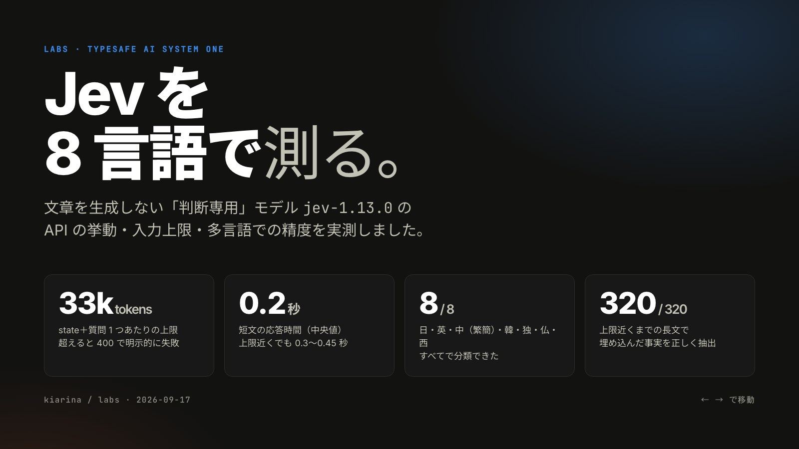

# TypeSafe AI Jev: API behavior, input limits, and eight languages

[](slides/index.html)

TypeSafe AIのSystem Oneモデル`jev-1.13.0`を、HTTP APIから直接評価します。
Jevは文章を生成せず、`state`と型付きの質問（Noul / Choice / Score）に確率で答えます。

入力の上限は、`state`と質問1つの組でおよそ33,000 tokenでした。英語なら約17〜21万文字、
日本語と中国語なら約3万文字、韓国語なら約4.3万文字に相当します。超えると
`400 max_tokens_exceeded`が返り、黙って切り詰められることはありません。
8言語すべてで、上限近くの長さでも埋め込んだ事実を位置によらず取り出せました。

## Purpose

公式docsには対応言語の記載がなく、入力上限は「stateと質問で共有する約32,000 token、
英語で約15万文字」とだけ書かれています。次の問いを実測で確認します。

- レスポンスの形、レイテンシ、同じリクエストを繰り返したときの揺れ
- 上限を超えたときの挙動と、上限が`state`、質問、リクエスト全体のどこにかかるか
- 日本語、英語、中国語（繁体字・簡体字）、韓国語、ドイツ語、フランス語、スペイン語で
  分類できるか。質問文を英語にした場合と各言語にした場合の差
- 言語ごとの1 tokenあたりの文字数と、`state`に入る最大文字数
- 上限近くまで長くしたとき、事実を取り出す精度が長さや位置で落ちるか

## Conditions

- model: `jev-latest`（応答では`jev-1.13.0`）、2026-09-17に計測
- client: 公式SDKを使わず`httpx`で`POST /v1/systemone`を呼ぶ。429/529のときだけbackoffして再試行する
- latency: 日本国内の開発機からのround trip。サーバー処理時間ではない
- 文字数: Pythonの`len()`（code point数）

多言語データは[`data.py`](data.py)にあります。英語を原文とし、ほかの7言語はLLMで翻訳して
目視で確認しました。ネイティブによる校正は受けていません。

- **分類**: SaaSサポートへの問い合わせ16件。次の3問を尋ねる
  - 担当部署: Choice（billing / technical / sales / account）
  - 急ぎか: Noul
  - 苛立ちの度合い: Score（3段階）

  正解ラベルは筆者が付けたもので、急ぎかどうかと苛立ちの度合いは主観を含みます。
  各問い合わせは言語判定のChoiceにもかけました。
- **長文**: 倉庫業務の日誌10文をseed付きでshuffleして繰り返した文章を使う。そこに次の2文を差し込む
  - needle: 「北側倉庫室のコードは4817」
  - distractor: 部屋だけが違う「南側倉庫室のコードは9352」

  needleを含むケース（positive）と、distractorだけのケース（negative）を用意しました。
  質問は英語の次の2問です。
  - 北側のコードが書かれているか（Noul）
  - 北側のコードは何か（Choice、選択肢に`not_stated`を含む）

  長さは各言語の上限の3% / 25% / 50% / 97%、needleの位置は0 / 25 / 50 / 75 / 100%です。
- **再現性**:
  - 分類: 各言語の質問文で10回ずつ繰り返す
  - 長文: 上限97%・中央配置のpositiveケースを10回繰り返す

## Run

```sh
export TYPESAFE_AI_API_KEY=...   # console.typesafe.ai で発行したキー
mise -C 2026/09/17/typesafe-jev-evaluation run
```

`probe_api.py`はフェーズ1（英語での挙動と上限）、`languages.py`は8言語の評価です。
結果はGit管理外の`output/probe_api.json`と`output/languages.json`へ保存します。
全体で約2,400リクエスト・約1,500万input tokenを使い、公表価格（$0.042 / Mtok）では約$0.6です。

## Slides

検証結果を12枚のスライドにまとめています（[`slides/index.html`](slides/index.html)）。
依存のない1ファイルのHTMLで、ブラウザで開いて←→キー、クリック、スワイプで移動します。
`#8`のように末尾に番号を付けると、そのスライドから開きます。

```sh
open 2026/09/17/typesafe-jev-evaluation/slides/index.html
```

ブラウザの印刷でPDFにすると、1ページに1枚ずつ出力されます。表紙画像`slides/cover.jpg`は、
`?capture#1`を付けて1600×900で描画したものです。

## Observed results

### Response and latency

```json
{
 "model": "jev-1.13.0",
 "answers": {
  "is_urgent": {"type": "noul", "noul": 0.95},
  "department": {"type": "choice", "choice": "billing", "confidence": 0.83,
                 "probabilities": {"sales": 0.0, "technical": 0.11, "billing": 0.89}},
  "frustration": {"type": "score", "score": 1.03, "confidence": 0.95,
                  "legend": {"0": "Calm", "1": "Frustrated", "2": "Very angry"},
                  "probabilities": {"0": 0.0, "1": 0.96, "2": 0.04}}
 },
 "usage": {"input_tokens": 426, "output_tokens": 73}
}
```

- Noulは確率だけを返し、`confidence`はChoiceとScoreにだけ付きます。
- `GET /v1/models`はaliasの`jev-latest`と`jev-preview`だけを返しました。
- 課金対象はinput tokenだけです。1文字の`state`に質問1問でも約273 tokenかかり、
  問い合わせ16件を足した分は英語265 token、日本語604 tokenでした。

| 条件 | round trip |
|---|---:|
| 短文、質問1〜3問 | median 205〜215 ms（180〜300 ms） |
| 上限近くの`state`（約33k token）、1問 | 320〜450 ms |
| 1文字の`state`＋質問1,000〜2,000問 | 0.8〜1.0 s |

長さに対するlatencyの伸びは小さく、約1.4k tokenから約32k tokenに増やしても
medianは約220 msから約330〜450 msでした。

### Input limits

| 言語 | 文字 / token | `state`に入る最大文字数 | UTF-8 bytes |
|---|---:|---:|---:|
| en | 5.12 | 167,345 | 167,345 |
| de | 3.75 | 122,581 | 124,175 |
| fr | 3.70 | 121,145 | 127,661 |
| es | 3.95 | 129,311 | 132,965 |
| ko | 1.30 | 42,659 | 103,445 |
| ja | 0.97 | 31,796 | 92,044 |
| zh-CN | 1.00 | 32,558 | 94,544 |
| zh-TW | 0.92 | 30,086 | 87,366 |

どの言語でも、成功した最大の入力は32,959〜32,997 tokenでした。上限はtoken数で決まり、
文字数やbyte数ではありません。文字数は文章の種類でも変わり、フェーズ1で同じ英文を
繰り返した場合は212,500文字（32,970 token、6.4文字/token）まで入りました。
docsの「英語で約15万文字」は控えめな目安です。日本語は1文字がほぼ1 tokenなので、
約3万文字が上限になります。

上限を超えたときの挙動と、上限のかかり方は次の通りです。

- 超過時は`400 {"detail": {"error_type": "max_tokens_exceeded"}}`が返ります。
  5,000,000文字でも同じ応答で、黙って切り詰められることはありません。
- 1文字の`state`なら、質問は2,375問（65,650 token）まで通り、2,382問で失敗しました。
- 約33k tokenの`state`に500問を足した合計46,188 tokenのリクエストは成功しました。
- 20k tokenの`state`に、15k tokenの質問文を1問だけ付けると失敗しました。

docsの「stateと質問で共有する約32,000 token」とは合いません。観測結果からは、次の2段の上限と
推定します。

- `state`と質問1つの組ごとに約33k token
- リクエスト全体で約66k token

`usage.input_tokens`は`state`を1回だけ数えています。

入力の検証については、次の挙動を確認しました。

- 質問0件は`422`になります。
- 存在しないモデルは`400 api_usage_error`になります。
- Scoreの段階が1つだけでも`200`が返りました。docsでは2段階以上が必須とされています。

### Languages: classification

各言語16件の結果です。「英語との差」は、担当部署の各確率と急ぎかのNoulについて、
英語の同じ問い合わせとの差の絶対値を平均したものです。

| 言語 | 部署 正解率（英語の質問 / 各言語の質問） | 急ぎか 正解率 | 英語との差 | 言語判定 |
|---|---:|---:|---:|---:|
| en | 16/16 / 16/16 | 0.73 / 0.73 | 0.000 / 0.005 | 16/16 |
| ja | 16/16 / 15/16 | 0.67 / 0.73 | 0.012 / 0.033 | 16/16 |
| zh-TW | 16/16 / 15/16 | 0.73 / 0.73 | 0.016 / 0.034 | 14/16（zh-CNと判定） |
| ko | 16/16 / 15/16 | 0.67 / 0.73 | 0.009 / 0.040 | 16/16 |
| zh-CN | 16/16 / 15/16 | 0.73 / 0.87 | 0.012 / 0.039 | 16/16 |
| de | 16/16 / 16/16 | 0.67 / 0.80 | 0.007 / 0.016 | 16/16 |
| fr | 16/16 / 16/16 | 0.67 / 0.73 | 0.014 / 0.029 | 16/16 |
| es | 16/16 / 15/16 | 0.73 / 0.80 | 0.011 / 0.032 | 16/16 |

- 英語の質問文を使うと、8言語とも担当部署を全問正解し、確率も英語と平均0.02未満の差でした。
  質問文を英語に固定すれば、`state`の言語による差はほとんどありません。
- 各言語の質問文では、英語との差が平均0.02〜0.04に広がりました。
  - 「今朝からチーム全員がログインできない」という問い合わせを、
    ja / zh-TW / ko / zh-CN / esでaccountと判定しました（確率0.55〜0.65）。
  - この誤りは、筆者が付けた選択肢の説明の曖昧さによるものです。
    accountの説明に「ログイン」、technicalの説明に「障害」を入れていました。
  - 翻訳した説明文の表現次第で、判定が境界を越えることを示しています。
- 急ぎかの誤りは、どの言語でもほぼ同じ問い合わせに集中しました。
  - 対象は「返金して」「カードが来月切れる」「リセットメールが届かない」などです。
  - いずれも筆者が「急ぎでない」とラベルを付けたもので、ラベル側の主観の影響が大きいと考えます。
- 苛立ちの度合い（Score）の平均誤差は、全言語0.16〜0.27段階でした。
- 言語判定を誤ったのはzh-TWの2件だけで、いずれもzh-CNと判定されました。
  漢字だけの短文では、繁体字と簡体字の区別が曖昧になります。

### Languages: long context

各言語40ケース（4つの長さ × 5つの位置 × positive / negative）の結果です。
Noulの値は、needleが書かれているかという問いへの答えです。

| 言語 | 3%（約1.4k tok） | 25%（約8.6k） | 50%（約16.7k） | 97%（約32.1k） | Choice正解 | 分離幅 |
|---|---|---|---|---|---:|---:|
| en | 0.98 / 0.02 | 0.98 / 0.02 | 0.98 / 0.01 | 0.98 / 0.02 | 40/40 | 0.95 |
| ja | 0.97 / 0.03 | 0.96 / 0.02 | 0.97 / 0.02 | 0.97 / 0.02 | 40/40 | 0.91 |
| zh-TW | 0.97 / 0.02 | 0.97 / 0.02 | 0.97 / 0.02 | 0.98 / 0.02 | 40/40 | 0.93 |
| ko | 0.97 / 0.03 | 0.96 / 0.02 | 0.96 / 0.02 | 0.95 / 0.02 | 40/40 | 0.87 |
| zh-CN | 0.95 / 0.02 | 0.95 / 0.02 | 0.95 / 0.02 | 0.96 / 0.02 | 40/40 | 0.85 |
| de | 0.97 / 0.02 | 0.97 / 0.02 | 0.96 / 0.02 | 0.95 / 0.02 | 40/40 | 0.92 |
| fr | 0.98 / 0.02 | 0.98 / 0.02 | 0.97 / 0.02 | 0.97 / 0.02 | 40/40 | 0.93 |
| es | 0.98 / 0.03 | 0.97 / 0.02 | 0.97 / 0.02 | 0.97 / 0.02 | 40/40 | 0.94 |

表の各セルは「positiveのNoul平均 / negativeのNoul平均」です。分離幅は、positiveの最小値から
negativeの最大値を引いた値です。

- 8言語すべてで、長さと位置によらず、positiveとnegativeを0.85以上の幅で分離しました。
- コードを答えるChoiceも320ケースすべて正解でした。部屋の方角だけが違うdistractorに
  引きずられず、needleがなければ`not_stated`を選びました。
- 英語の質問文で、各言語の`state`を読めています。
- この長文テストは易しい部類です。haystackが10文の繰り返しで、needleの形式も
  周囲から浮いています。自然な長文に紛れた事実や、複数の箇所を組み合わせる推論は未検証です。

### Repeatability

- **分類**: 同じリクエストでも確率は決定的ではありませんでした。
  - 10回繰り返したときの標準偏差の平均は0.003〜0.005、最大は0.056（de）でした。
  - 選ばれた部署が10回の中で変わったのは、80系列中1系列だけでした。
    deの「チーム全員がログインできない」で、10回中1回だけaccountになりました。
- **長文**: 上限97%の長文では、Noulの標準偏差が0〜0.0075で、Choiceは10回とも同じでした。

境界付近（確率0.4〜0.6）の判定は、同じ入力でも入れ替わることがあります。
confidenceやマージンで保留する設計が必要です。

## Notes

- docsの記述と挙動が一致しない点が3つありました。
  - 上限のかかり方
  - 英語で入る文字数
  - Scoreの段階数の検証
- docsはrate limitが予告なく変わると明記しています。client は429を自動で再試行するため、本labでは429の発生回数を記録していません。
  負荷をかけて429を起こすことは意図的に避けています。
- API keyはリポジトリに含めず、環境変数からだけ読みます。
