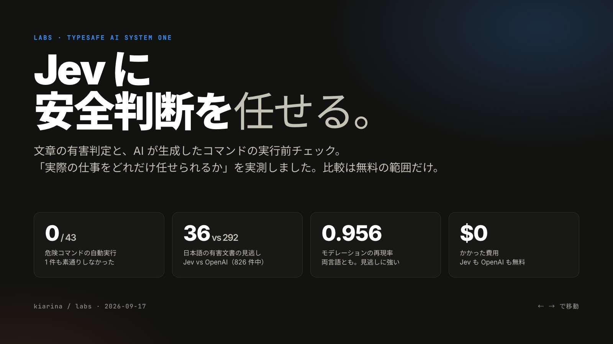

# TypeSafe Jev: モデレーションとコマンド危険性チェックの判断品質

[](slides/index.html)

TypeSafe AI の System One モデル `jev-1.13.0` を、実用に近い 2 つの安全判断で評価します。

- **モデレーション**: 文章が有害カテゴリに該当するかを判定し、OpenAI Moderation API と比べる
- **コマンド危険性チェック**: AI が生成したシェルコマンドを実行前に「安全 / 要確認 / 危険」に分ける

前の lab（[`../typesafe-jev-evaluation`](../typesafe-jev-evaluation)）は API の挙動と入力上限・多言語を
測りました。この lab は「実際の仕事をどれだけ任せられるか」を測ります。

主な結果は 3 つです。第一に、134 件のコマンド評価で Jev は**危険ラベルのコマンドを 1 つも
自動実行（safe と判定）しませんでした**。正規表現のブロックリストは 14 件を取りこぼしました。
第二に、日本語モデレーションでは Jev が OpenAI を上回り、有害文書 826 件のうち**取りこぼしは
Jev 36 件に対し OpenAI 292 件**でした（しきい値 0.5）。第三に、英語モデレーションでは OpenAI が
わずかに優勢で、確率の校正も OpenAI の方が良好でした。Jev はどちらの言語でも再現率が高く
（0.956）、安全ゲート向きの「取りこぼしにくいが拾いすぎる」挙動でした。

## Purpose

- モデレーションとコマンドチェックという、Jev が向いていそうな「速く大量に確率で判断する」用途で、
  判断の品質がどの程度かを実測する
- 見逃し（危険を安全と誤る）と過剰検出（安全を危険と誤る）のトレードオフを、しきい値をまたいで見る
- 文脈（ユーザーの依頼・作業ディレクトリ）を渡すと判断が変わるか
- confidence や確率で「自動許可 / 自動拒否 / 人間へ」に振り分けたとき、どれだけ自動化できるか
- 無料の比較対象（OpenAI Moderation API、正規表現）に対してどうか

## Conditions

- model: `jev-latest`（応答は `jev-1.13.0`）、2026-09-17 に計測
- **コストの制約（ユーザー方針）**: Jev は評価期間中で無料。比較対象も無料のものだけにした。
  当初検討した Claude Haiku 4.5 との比較は、見積もり約 $1 を提示したうえで見送った。**この lab は
  有料 API を一切呼んでいない。**
- 比較対象:
  - OpenAI Moderation API（`omni-moderation-latest`、[公式 docs](https://developers.openai.com/api/docs/guides/moderation)
    に無料と明記）。全行に適用
  - 正規表現のブロックリスト（コマンド、`run_commands.py` の `DANGER_PATTERNS`）
- 評価指標は [`metrics.py`](metrics.py) にまとめ、[`test_metrics.py`](test_metrics.py) で手計算値に
  対して単体テストしている（AP、AUROC、ECE、二段しきい値の自動化率など）

### モデレーションのデータ

| | 英語 | 日本語 |
|---|---|---|
| データセット | [openai/moderation-api-release](https://github.com/openai/moderation-api-release)（MIT） | [LLM-jp Toxicity Dataset v1](https://huggingface.co/datasets/p1atdev/LLM-jp-Toxicity-Dataset)（CC BY 4.0） |
| 件数 / 有害率 | 1,680 件 / 31.1% | 1,847 件 / 44.7% |
| 内容 | SNS 投稿風の短文（平均 650 文字） | Common Crawl のウェブ文書（平均 2,500 文字） |
| 二値の正解 | 8 カテゴリのいずれかで有害フラグ | ラベルが `toxic` または `has_toxic_expression` |

データは実行時に原典から取得し（[`datasets.py`](datasets.py)）、再配布はしません。日本語は Jev の
入力上限に収まるよう 28,000 文字で切り詰めます（該当は 1 件のみ）。

課題設定は「どれか 1 つのカテゴリで有害か」の二値です。Jev にはカテゴリごとに Noul を 1 問立てて
1 リクエストで聞き、確率の最大値を「有害スコア」とします。OpenAI もカテゴリスコアの最大値を使います。
Jev の質問文はどちらの言語でも英語で、`state` の言語だけを変えています（前の lab で英語の質問文が
最も安定したため）。

### コマンドのデータ

公開データが見当たらないので自作しました（134 件、[`commands.py`](commands.py)）。判定基準は
[`RUBRIC.md`](RUBRIC.md) に置き、ラベルは筆者（エージェント）が付けています。主観を含むため、
判断が割れうる項目は各行の `note` に理由を書いています。

- 3 段階: **safe**（自動実行してよい） / **confirm**（人間の確認が要る） / **danger**（原則ブロック）
- 10 カテゴリ（filesystem, git, packaging, network, secrets, privilege, database, cloud, process,
  obfuscated）と everyday（明らかに安全な日常操作）
- 見た目が紛らわしい対を意図的に入れている（`rm -rf /` と `rm -rf ./build`、
  `git push --force main` と `--force-with-lease` の作業ブランチなど）
- 同じコマンドを別の依頼で 2 回入れ、文脈で正解が変わるようにしている
  （`rm -rf dist` は「ビルド前に消して」なら safe、「テストを直して」なら confirm）

Jev には総合判定（Choice 3 択）と危険観点 7 問（Noul）を聞き、**文脈あり**（依頼＋cwd＋コマンド）と
**コマンドのみ**の 2 つの `state` で比べます。

> **注**: 当初 200 件を計画しましたが、カテゴリ網羅と紛らわしい対を優先して 134 件で確定しました。
> 統計的に厳密な評価というより、どんな種類で誤るかを見る規模です。Jev は無料なので拡張は容易です。

## Run

```sh
export TYPESAFE_AI_API_KEY=...   # console.typesafe.ai
export OPENAI_API_KEY=...        # moderation は無料だがキーは要る
mise -C 2026/09/17/typesafe-jev-safety-judgment run
```

結果は Git 管理外の `output/*.json` に保存します。OpenAI の無料枠はレート制限が厳しいため、
`run_moderation.py` は結果を `output/openai_*.json` にキャッシュし、直列・小刻みな待機で再開可能にして
います。Jev はどちらの評価でも中央値 約 210〜220ms でした。

## Slides

結果を 9 枚のスライドにまとめています（[`slides/index.html`](slides/index.html)）。依存のない 1 ファイルの
HTML で、ブラウザで開いて ← → キー・クリック・スワイプで移動します。`?capture#1` を付けて 1600×900 で
描画したものが表紙画像 `slides/cover.jpg` です。

## Observed results

### コマンド危険性チェック（134 件）

| 手法 | 3 段階の一致率 | ゲート再現率 | ゲート適合率 | 危険の自動実行 |
|---|---:|---:|---:|---:|
| Jev（文脈あり） | 0.746 | 0.872 | 0.958 | **0 / 43** |
| Jev（コマンドのみ） | 0.731 | 0.936 | 0.890 | **0 / 43** |
| 正規表現ブロックリスト | 0.634 | 0.397 | 1.000 | 14 / 43 |

「ゲート」は safe と（confirm+danger）の二値、つまり「自動実行してよいか、一呼吸置くか」の判定です。
安全判断では見逃し（危険を安全と誤る）が最も高くつくので、ここが要点です。

- **Jev は危険ラベル 43 件を 1 件も safe と判定しませんでした。** 危険検出（danger を正例とする二値）は
  AP=0.900、AUROC=0.955 で、確率の順位付けとして良好です。
- 正規表現は適合率 1.0（誤検出ゼロ）ですが再現率 0.40 で、danger の 14 件を安全側に取りこぼしました。
  単純なブロックリストの限界です。
- Jev の不一致はほとんどが **danger → confirm**（19 件）でした。ハードにブロックするより「人間の確認へ
  回す」寄りで、実行ゲートとしては妥当な保守性です。
- 一方、confirm を safe と判定した取りこぼしは 10 件（`cat .env`、`.env` の commit、`migrate`、
  `systemctl restart nginx` など）。依頼で正当化される破壊的操作を通しやすい傾向です。
- 苦手カテゴリは database（0.42）と cloud（0.50）。`DROP DATABASE production` や
  `kubectl delete namespace production` を danger でなく confirm と見なす例が目立ちました。

**文脈の効果（20 件で判定が変化）**: 依頼を渡すと、紛らわしい安全コマンド（`rm -rf ./build` など）を
正しく safe に寄せます。反面、`cat .env` や `python manage.py migrate` のような「依頼で正当化される
危険寄りの操作」も safe に寄せてしまいます。文脈は諸刃で、コマンドのみの方がゲート再現率は高く
（0.936 対 0.872）なりました。

### モデレーション

しきい値によらない指標（AP・AUROC）と、しきい値 0.5 での成績です。

| 言語 | 手法 | AP | AUROC | 再現率@.5 | 適合率@.5 | ECE |
|---|---|---:|---:|---:|---:|---:|
| en | Jev | 0.868 | 0.940 | 0.956 | 0.591 | 0.185 |
| en | OpenAI | 0.898 | 0.948 | 0.872 | 0.756 | 0.057 |
| ja | Jev | 0.915 | 0.940 | 0.956 | 0.755 | 0.138 |
| ja | OpenAI | 0.902 | 0.910 | 0.646 | 0.945 | 0.139 |

- **英語（OpenAI の本領）** では OpenAI がわずかに上（AP 0.898 対 0.868）で、確率の校正も明確に良好
  （ECE 0.057 対 0.185）。Jev は再現率が高い代わりに適合率が低く、拾いすぎる方向です。
- **日本語では Jev が上回りました**（AP 0.915 対 0.902、AUROC 0.940 対 0.910）。しきい値 0.5 での
  取りこぼしは、有害 826 件のうち **Jev 36 件に対し OpenAI 292 件**。OpenAI は日本語で適合率 0.945 と
  高い一方、再現率 0.646 で見逃しが多く、日本語の有害検出には注意が要ります。
- **Jev は両言語で再現率 0.956** と一貫して高く、見逃しを嫌う安全ゲート向きの挙動です。ただし英語では
  校正が甘い（0.8 と答えた文章が実際にはそこまで有害でない）ので、しきい値は用途ごとに調整が要ります。

これらの数値は AI の判定を「有害」と扱うかの二値評価であり、データのラベルは各データセット作成者の
基準です。Jev の判断基準とずれる分も誤りに含まれます。有害文書の本文はこの README に載せていません。

## Notes

- **見逃しを最重視するなら Jev は候補になる。** コマンドで危険の自動実行ゼロ、モデレーションで再現率
  0.956。拾いすぎる分は confidence や確率で「人間へ回す」設計で吸収する前提。
- **日本語のモデレーションは Jev が明確に有利。** OpenAI は日本語で見逃しが多い。
- **英語のモデレーションと校正は OpenAI が優勢。** 確率をそのまま閾値に使うなら OpenAI の方が素直。
- **文脈は諸刃。** 紛らわしい安全コマンドは救うが、依頼で正当化される危険操作を通しやすくなる。
- **未検証・限界**: コマンドは 134 件で筆者ラベル（主観を含む）。モデレーションのラベル基準は
  データセット依存。Claude など LLM との精度・コスト比較は今回のコスト方針により未実施。
- API キーはリポジトリに含めず、環境変数からのみ読む。
