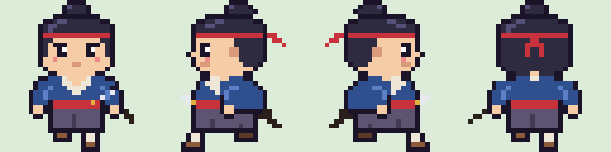
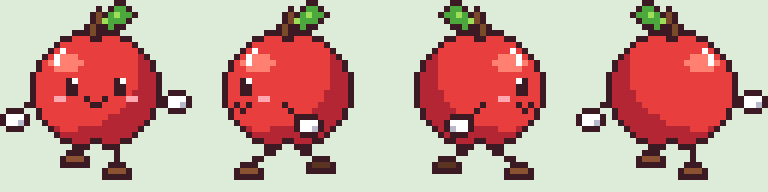
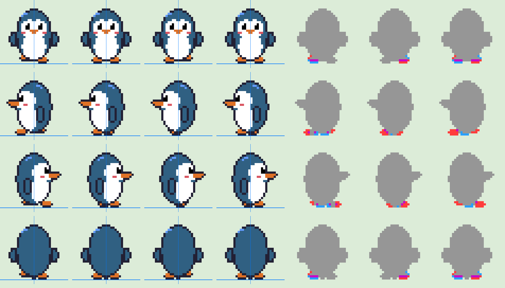
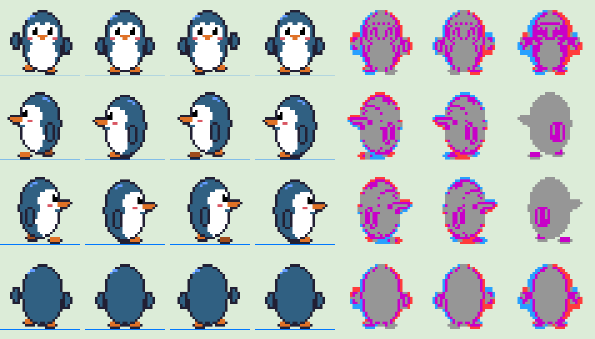
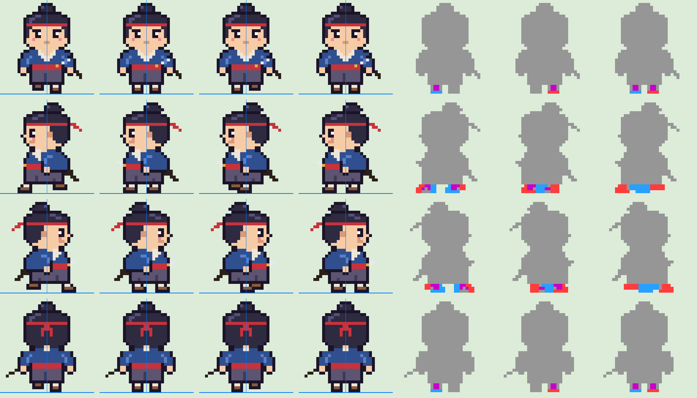
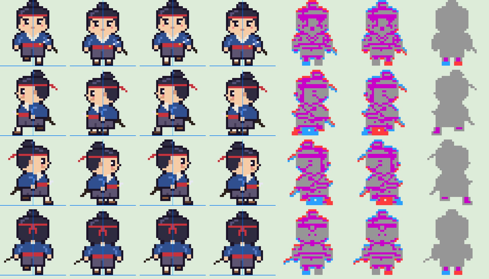
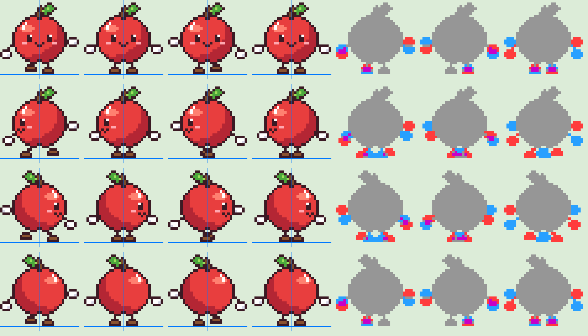
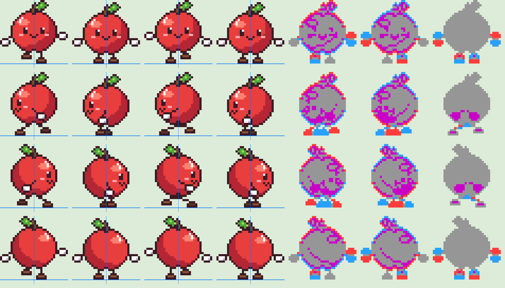

# Drawing walk-cycle pixel-art sprite sheets in plain Python, and reviewing the animation from stills

コーディングエージェントが、お絵かきソフトを使わずに Python（Pillow）だけで、RPG でよく使う歩行のスプライトシートを
どこまでの品質で描けるかを確かめます。さらに、エージェントは GIF を動画として見られないので、静止画と数値に分解して
アニメーションの破綻を見つけ、直せるかも確かめます。





## Purpose

1. 32×32 のちびキャラの 4 方向 × 3 コマの歩行シートを、Python のコードだけで描けるか。どんな描き方が向くか
2. GIF を見られないエージェントが、アニメーションの不自然さを自分で見つけて直せるか
3. （先に試したこと）Aseprite を Computer Use でマウス操作して描けるか

## Answer

- **描けました。** ペンギン・侍・りんごのゆるキャラの 3 体を、それぞれ 170〜240 行ほどの Python で描きました。形は 3 通りの描き方を試しました
  - ペンギン: 楕円の式で胴体と顔の白を作り、縁を 1px の輪郭にする。目・くちばし・ほっぺなどの細部は座標で置く
  - 侍: 32×32 のマスを 1 文字 1 色の文字列で直接書く（正面・横・後ろの 3 枚）。ちょんまげ・鉢巻・刀など、式では作りにくい形に向く
  - りんご: 楕円の式に、光源からの距離で影とツヤを入れる。輪郭は「塗った部分のまわりを 1px で縁取る」処理で自動で引き、
    手足は線を引く処理と手袋・靴の型押しで描く。腕の振りや足の位置を数字で変えるだけでコマを作り分けられる
- 右向きは左向きの左右反転、歩きのコマは足や体の位置の差し替えで作るので、コマが増えても手間はあまり増えません
- **アニメーションの破綻は、静止画と数値に分解すると見つけられました。** 3 体とも最初の版には同じ問題がありました（下の「Review」）。
  直した後の版をもう一度同じ方法で確かめ、直しの副作用（りんごの横向きの腕が体を横切る棒になった）も見つけて直しています
- Aseprite を Computer Use で操作する試みは途中で止めました（下の「Failed attempt」）

## Review（アニメーションの確かめ方）

`review.py` が 1 枚の診断の画像と数値を出します。

- 左の 4 列: 再生順（0 → 1 → 2 → 1）に並べたコマ。直立のコマの接地の行と中心に青い線を引く
- 右の 3 列: オニオンスキン（0 と 1、1 と 2、0 と 2 を重ねる）。灰色は同じ、紫は位置が同じで色が違う、赤は前のコマだけ、青は後のコマだけ
- 数値: コマごとの外枠、重心、接地の行、塗られた画素の数

### 見つかった問題（3 体とも最初の版。`results/v1/`）

観測したこと:

- オニオンスキンで、体のほとんどが全コマで灰色のまま（体がまったく動かない）
- 正面は、足が 1px しか動かない。りんごは逆に腕が上下に 5px 振れ、足との釣り合いが悪い
- 横向きの 0 と 2 のコマで、両足が同じ色のうえに重なって 1 つの塊になる。0 と 2 の違いが読めない
- 横向きのりんごの腕が前後に水平に突き出たまま（飛行機のポーズ）

解釈: 足だけが動くので地面を滑って見える。横向きは手前と奥の足を見分けられないので、歩いているように読めない。

### 直したこと

| | 直したこと |
|---|---|
| 3 体共通 | 横向きの奥の足（と靴・足袋）を暗い色にして奥に描き、0 と 2 のコマで前に出る足を入れ替える |
| りんご | 踏み出しのコマで体を 1px 弾ませる。正面は足を 2px 上げて腕の振りを小さくし、腕を足と逆に振る。横向きの腕は短くして体の上で前後に振る |
| 侍 | 踏み出しのコマで体を 1px 弾ませる。地面に着いている足は足袋を 1 行伸ばして袴の裾と離れないようにし、上げた足は裾の下に 2px 引っ込める |
| ペンギン | よちよち歩きにする。正面と後ろは地面に着いた足の側へ体を 1px 寄せ、上げた足の側のフリッパーを持ち上げる。横向きは体を弾ませ、フリッパーを前後に振る |

直す前と後の診断の画像:

| | 直す前 | 直した後 |
|---|---|---|
| ペンギン |  |  |
| 侍 |  |  |
| りんご |  |  |

最後に GIF もコマに分け直して、16 コマ・1 コマ 180 ms・ループ再生になっていることを確かめました。

## Failed attempt: Aseprite を Computer Use で操作する

最初は、Aseprite（v1.3.17.2、macOS）を Computer Use のマウス操作で「ぽちぽち」描く計画でした。Python で設計図を作り、それを
「パレットの色をクリック → 鉛筆で横に連続する画素をドラッグ」の操作列に変換して流し込む方式です。観測したこと:

- 裏で操作する方式（アプリを前面に出さない app_* のクリック）は Aseprite に届かない（独自描画の UI のため）。画面全体を操作する方式に切り替えた
- 文字列の入力（`type`）では数字が 1 文字しか入らなかった（`96` が `1` に）。1 キーずつ押すと入った
- ズーム率の入力欄への入力は効かなかった。数字キー（`4` で 800%）は効いた
- **鉛筆のドラッグは途中の画素が抜ける。** 1 回の操作のドラッグでは始点付近しか塗られず、ボタンを押す・動かす・離すを分けても始点と終点の 2 点だけが塗られた

1 画素ずつクリックすれば描けたはずですが、1 枚目だけで約 400 回のクリックになる見込みだったため、Python で直接描く方針に切り替えました。
Aseprite で描いた画像はこの lab にありません。

## How to run

```sh
mise run   # results/ に 3 体のシート・6 倍の見本・歩きの GIF・診断の画像と数値を出す
```

- 出力は決定的です（乱数を使わない）。`results/` の 3 枚のシートが、検証中に作った画像と画素単位で一致することを確かめました
- `results/v1/` は直す前の版のシートと診断の画像です。直す前のコードはこの lab に残していないので、この 2 つは再生成できません

## Environment

- macOS 27.0.1、Python 3.12.10（uv が用意）、Pillow 12.3.0
- 参考にしたのは、作者の既存キャラクター（猫のちびキャラ）の 96×128 の歩行シート 1 枚です（非公開のためこの lab には入れていません）。
  形式（32×32、3 列 = 踏み出し・直立・踏み出し、4 行 = 下・左・右・上）だけを合わせました

## Limitations

- 品質は、作者とエージェントが見本を見て「かわいい・侍らしい」と判断した範囲です。第三者の評価や、職人のドット絵との比較はしていません
- アンチエイリアス、手描きらしい線の揺らぎ、複雑なポーズは試していません。3 コマの歩行より滑らかな動きにはコマを増やす必要があります
- 診断で確かめられるのは位置・接地・動く部分の量です。テンポの気持ちよさ（1 コマ 180 ms が適切か）は判断していません
- 色はペンギンだけ Aseprite の既定パレット（DB32）から選び、侍とりんごは独自の色です
